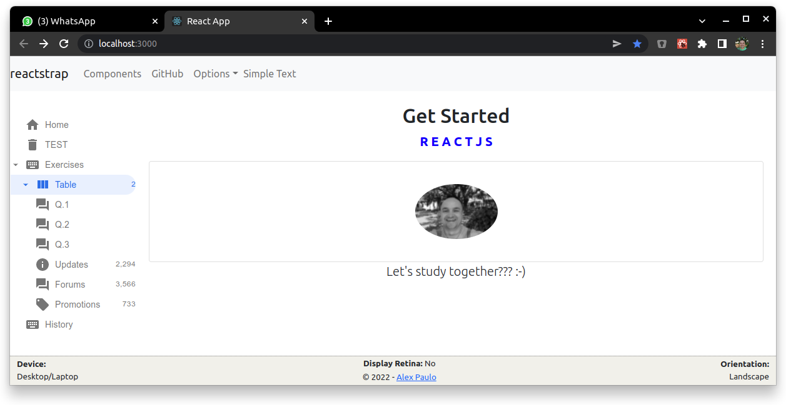

# Responsividade

## O que é responsividade?

Uma aplicação responsiva é aquela cuja disposição do conteúdo se adapta em função do tamanho da tela.

## Que biblioteca o aluno de utilizar para criar sua primeira aplicação responsiva?

Aquela que ele mais gostar. Existem várias.

**Note: O professor demonstrará um caso prático**

# Exercício acerca de responsividade

## 1) Escreva uma aplicação responsiva, que apresente:

a)  Um formato para as telas de Desktop/Laptop, conforme exemplo abaixo:

b) Outro formato para as telas de Tablet/Mobile, conforme exemplo abaixo:

